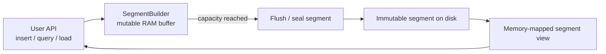
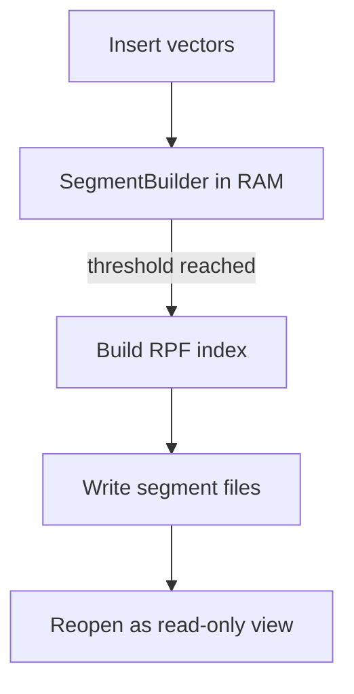
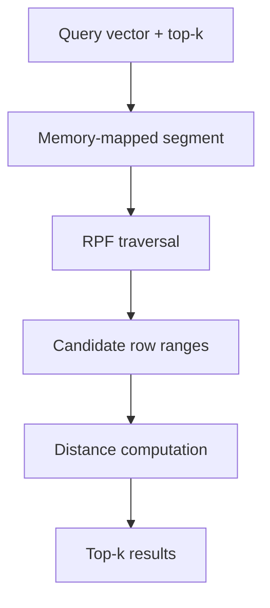

# dendra

`dendra` is a simple vector database built around immutable, memory-mapped segments and random projection trees.

## Design

The current architecture combines an LSM-style ingest path with a Random Projection Forest (RPF) per sealed segment.

### High-Level Flow

### Write Path

### Read Path

## On-Disk Layout

Each sealed segment is stored as a directory with four files:

- `metadata.bin` - segment schema header and counts
- `vectors.bin` - vector payload
- `ids.bin` - external id column
- `index.bin` - RPF forest and per-tree lookup tables

The segment format is intentionally small and versioned so future codecs and storage changes can be added without breaking old data.

## In-Memory Model

### Segment

- `vectors` - contiguous vector payload
- `external_ids` - row-aligned user ids
- `dim` - vector dimension
- `index` - random projection forest for candidate generation

### RPF

- Each tree owns its own row lookup table.
- Leaf nodes point to contiguous row ranges inside the tree-local lookup.
- Candidate generation deduplicates by tree index and row range.

## Current Implementation Status

Implemented:

- segment build and query path
- sealed segment file layout
- versioned headers for segment and forest files
- per-tree lookup ownership in the RPF

Planned next:

- store lifecycle and recovery
- quantized vector codecs

## Notes

- The current codebase keeps vectors in `f32` for now.
- Quantization is planned, but it is not yet the default storage format.
- Delete support is not implemented yet.
